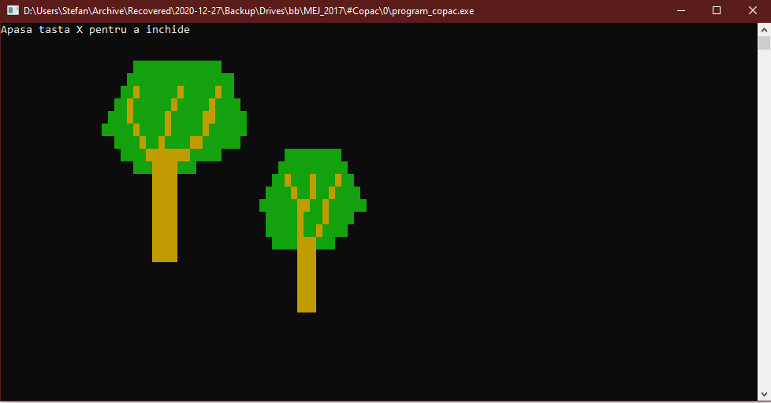
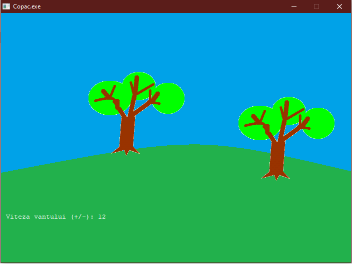
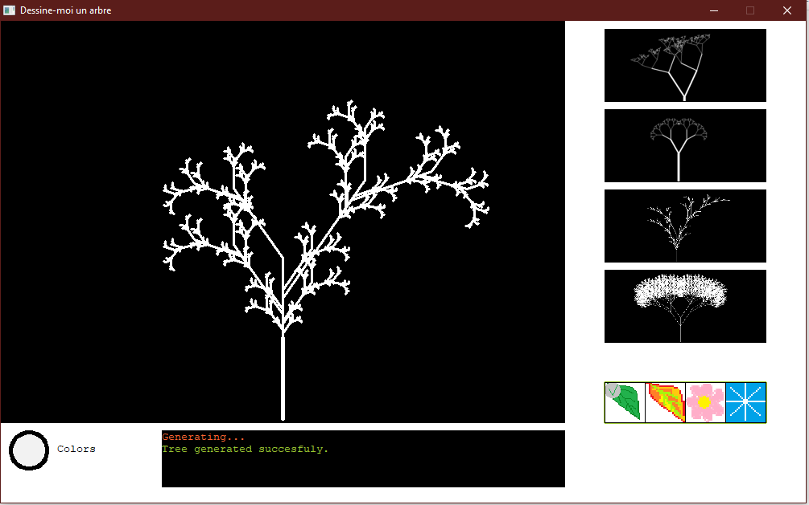
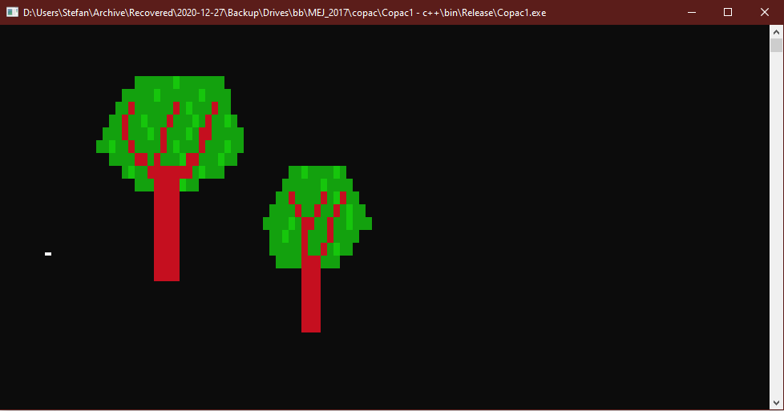
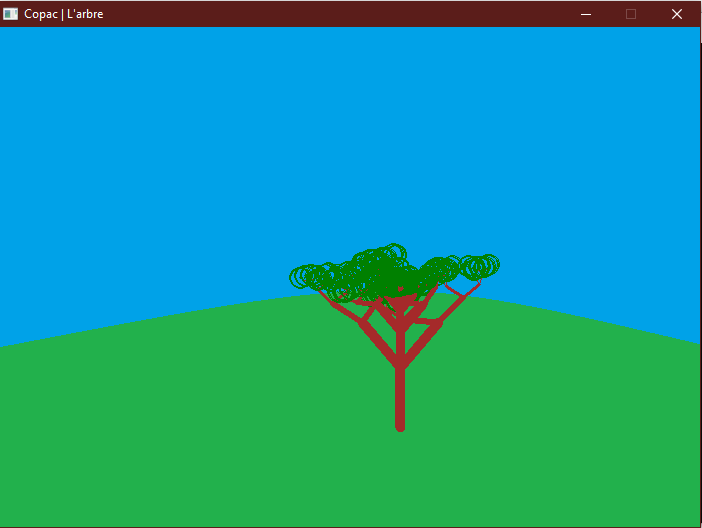
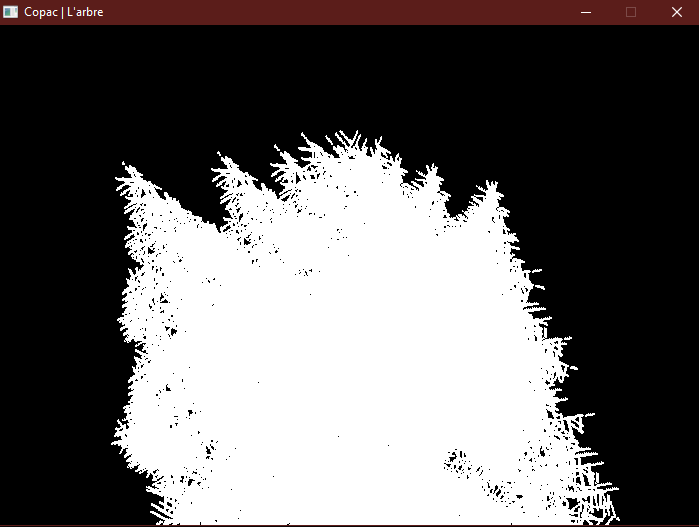
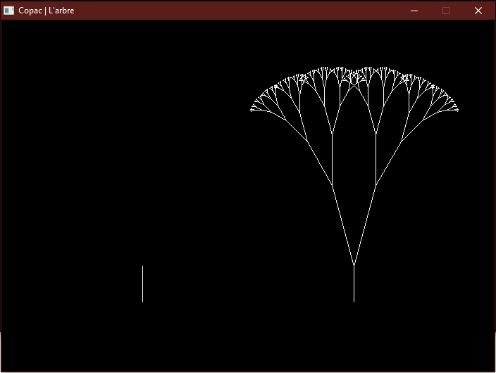
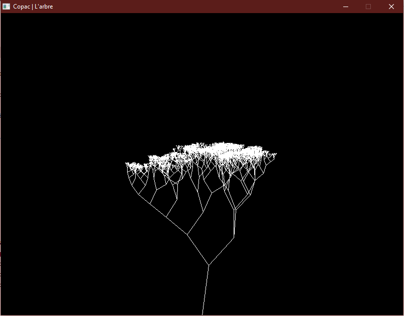

## MEJ 2015-2017 Subject: Dessine-moi un arbre

**Warning:** Do **NOT** run any executable files existent on this repo on your system. This code is work of a 13yo kid who was barely knowing what he was doing. The apps may freeze/crash/be necessary to close from external sources like the task manager. I have attached screenshots of (working) programs instead.

 #Copac/0

 #Copac/2

 copac/copac

 copac/copac1_c++

 copac/copac3

 copac/copac4

 copac/copac6

 copac3_fractal
